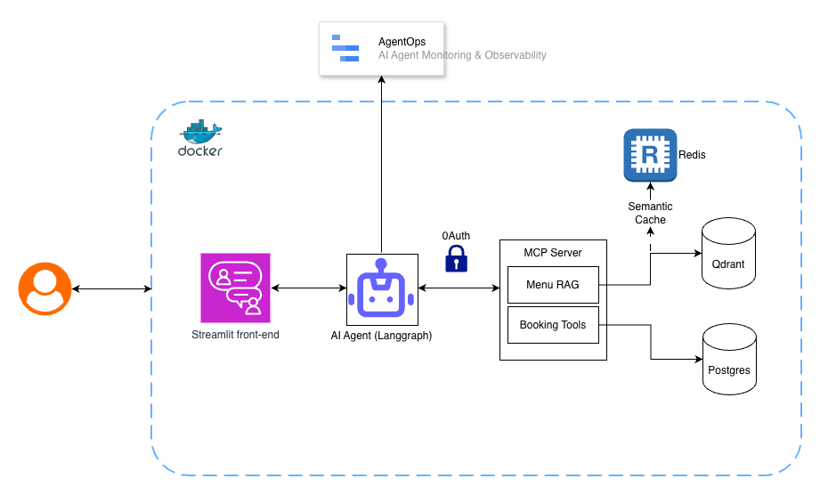
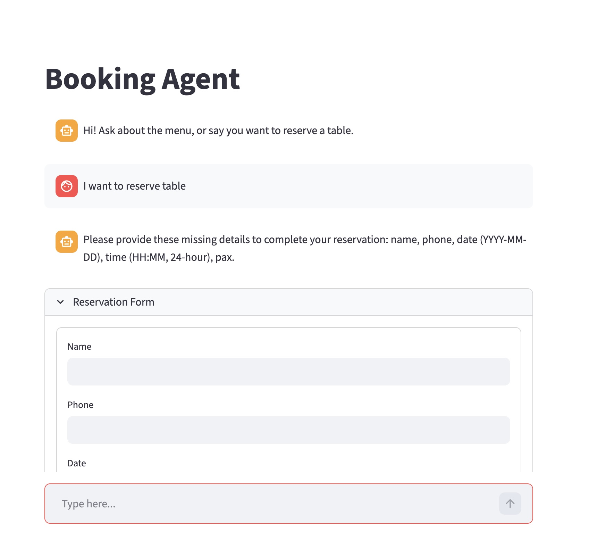
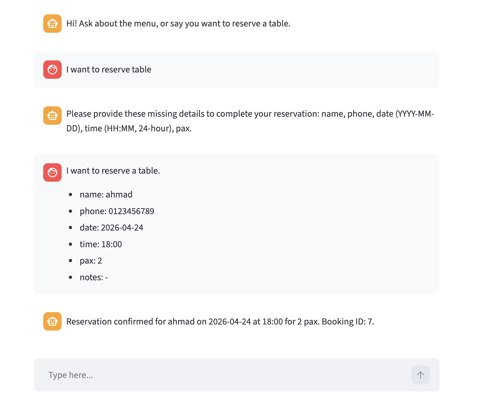
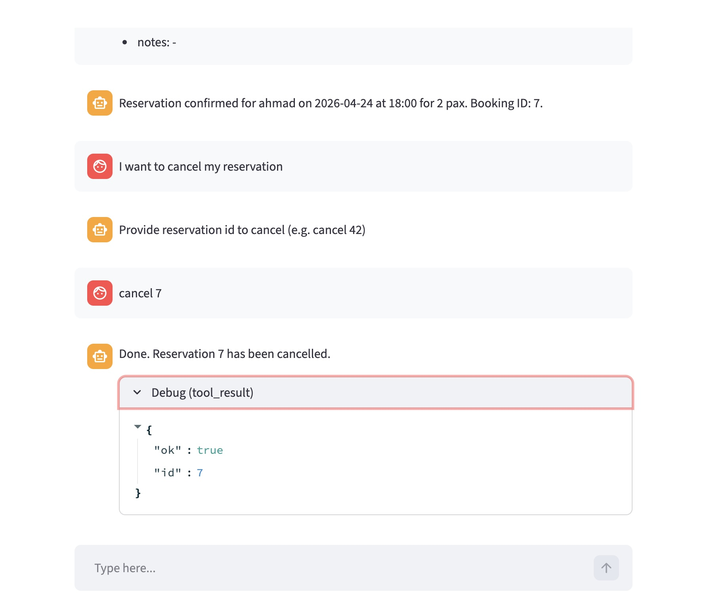
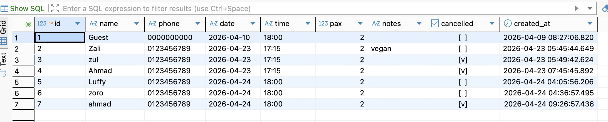
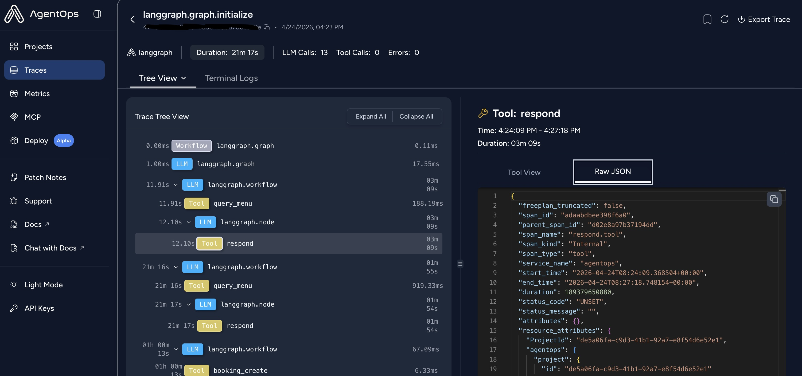
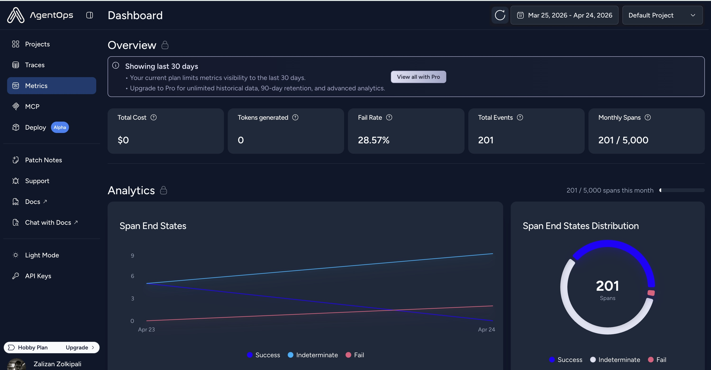

# Restaurant Booking AI Agent

Agentic AI that helps users check the restaurant menu and reserve tables.

## About this project

This is a personal proof-of-concept to try out Docker-based LLM workflows: chat and embeddings run locally (Ollama in Compose), and the stack avoids public hosted LLM APIs and cloud-hosted vector databases. Menu search uses Qdrant on local disk inside the compose network, Redis for a local menu RAG cache, and Postgres for bookings storage.

For monitoring and observability, the agent can use [AgentOps](https://www.agentops.ai/) to trace sessions and debug runs alongside your local stack. 

## Tools & tech stack

- **Streamlit** – frontend
- **LangGraph** – orchestration of AI agents
- **MCP** – all tools centralized; **streamable-http** transport for security
- **Qdrant** – vector database (menu RAG)
- **Redis** – cache for `query_menu` results.
- **Postgres** – reservations database
- **Docker** – infrastructure
- **Ollama** – local model for chat and embeddings
- **RAG** – restaurant menu stored and queried via embeddings
- **AgentOps** – optional tracing / observability ([agentops.ai](https://www.agentops.ai/)); set `AGENTOPS_API_KEY` on the agent service when enabled

## Ollama models

- `smallthinker` – chat
- `nomic-embed-text` – embeddings

## Diagram


## Screenshot

### Reservation flow







### Database record



### Monitoring





## Workflow

- User can ask about **menu**, **table availability**, or **reserve/cancel** a table.
- **Menu**: agent calls MCP `query_menu`, which checks Redis first, then runs vector search against Qdrant on cache miss.
- **Reservation**: agent uses Postgres via MCP tools.
- **Security**: agent authenticates to MCP using local OAuth2 client-credentials (`/oauth/token`) and sends bearer tokens for MCP calls.

### Agent split (security)

Agents are split so each can only call a subset of tools:

| Agent           | Access   | MCP tools                                      |
|----------------|----------|-------------------------------------------------|
| Menu           | RAG only | `query_menu`, `menu_count`                      |
| Booking-read   | Read DB  | `booking_check_availability`, `booking_list`   |
| Booking-write  | Write DB | `booking_create`, `booking_cancel`              |

- All tools live in MCP; MCP runs as **streamable-http**.
- Only the appropriate agent can call read vs write booking tools; input is validated inside MCP.

## Environment file (`.env`)

Before you run `./start.sh`, `./ingest.sh`, or `docker compose`, set up environment variables at the repository root.

1. Copy the example file and edit values as needed:
   ```bash
   cp .env.example .env
   ```

**What to customize**

- **`AGENTOPS_API_KEY`** — optional; leave empty or remove if you are not using [AgentOps](https://www.agentops.ai/). If set, the agent service receives it for tracing.
- **`POSTGRES_*`**, **`DATABASE_URL`** — database user, password, DB name, and database URL used by mcp_server.
- **`REDIS_URL`**, **`MENU_CACHE_TTL_SECONDS`** — menu cache for MCP `query_menu`.
- **`MCP_SERVER_PORT`**, **`STREAMLIT_PORT`**, **`POSTGRES_PORT`** — host port mappings if you need to avoid conflicts.
- **`MCP_OAUTH_CLIENT_ID`**, **`MCP_OAUTH_CLIENT_SECRET`**, **`MCP_OAUTH_SIGNING_KEY`**, **`MCP_OAUTH_TOKEN_TTL_SECONDS`**, **`MCP_OAUTH_TOKEN_URL`** — local OAuth2 settings for agent→MCP authentication.


## Run with shell scripts (recommended)

### `./start.sh` — run the app

- Does **not** ingest the menu. Use `./ingest.sh` when you add or change menu data and need to refresh Qdrant.
- When it finishes, open **http://localhost:8501**.

```bash
./start.sh
```

### `./ingest.sh` — ingest (or re-ingest) the menu

Use this when **`sample_menu/sample_menu.pdf`** is present and you want to load or update the vector index.

```bash
./ingest.sh
```

## Run with Docker (manual)

Equivalent to what the scripts automate:

```bash
docker compose up -d --build
```

- Streamlit: http://localhost:8501  
- Pull Ollama models (first time):  
  `docker compose exec ollama ollama pull smallthinker`  
  `docker compose exec ollama ollama pull nomic-embed-text`

### Ingest menu (RAG) without `ingest.sh`

1. Put a PDF at `./sample_menu/sample_menu.pdf`.
2. Stop services that use Qdrant if you hit file-lock errors, then run:  
   `docker compose --profile ingest run --rm ingest`
3. Start the stack again: `docker compose up -d --build`

## Project layout

- `start.sh` – bring up the full Docker stack and pull Ollama models
- `ingest.sh` – one-off menu ingest (handles Qdrant lock + cache invalidation).
- `streamlit/` – Streamlit UI
- `agents/` – LangGraph agents (FastAPI), MCP client with scoped tools
- `mcp_server/` – MCP server (streamable-http), menu RAG + booking tools, input validation
- `ingest/` – one-off job to ingest menu (JSON preferred, PDF fallback) into Qdrant
- `db/` – Postgres init (tables created by MCP server)
